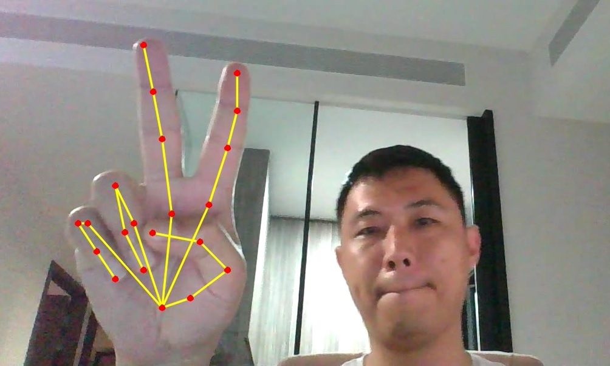

# Hand-Gestures-Recognition

Skeletal derivation of gestures is one efficient method to detect hand gestures
without suffering from angles, blind spot, different size & variation of human beings

It also eliminates the need for 3D hardware and/or 3 cameras pinpointing from different angles

This method can be used in crowded area eg. Shopping Mall for thief & violence detection;
Surgery training; Sports coaching like posture of hitting the ball;
Replicating the skeletal movement to augment reality;
Using Skeletal movement to remotely control a robot

The potential limit is your creativity

Our research was presented in Jan-2020 at ICMLSC conference & paper published in Mar-2020
https://dl.acm.org/doi/abs/10.1145/3380688.3380711

